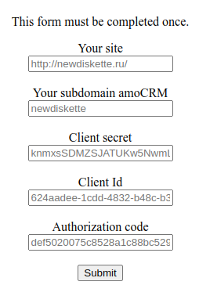

# amoCRM

Вы можете увидеть пример реализации на моём [сайте](http://newdiskette.ru/php/amoCRM/ "http://newdiskette.ru/php/amoCRM/")

## Моя программа умеет:

    * Получать и обновлять access token, refresh token
    * Сохранять access token в файл helpers/config/accessToken.txt
    * Сохранять refresh token в файл helpers/config/refreshToken.txt 

    * Получать данные вашего аккаунта amoCRM, ваших контактов, ваших сделок

## Ваши действия:

1. Сохраните все файлы в папку amoCRM

2. Создайте интеграцию в вашем аккаунте amoCRM

3. Заполните форму [Start](helpers/formStart.html "This form must be completed once.")

## Форма:

1. Your site:
    
    * Пример1: http://newdiskette.ru/
    * Пример2: https://newdiskette.ru/

2. Your subdomain amoCRM:
    
    * Пример1: newdiskette
    * Пример2: diskette

3. Client secret: секретный код
    Пример: knmxsSDMZSJATUKw5NwmLkvJMNrkADnPhiDXfuWJRo5zmQtR9dUFWyjAq6gG2BIs

4. Client Id: ID интеграции
    Пример: 624aadee-1cdd-4832-b48c-b33126b9304d

5. Authorization code: авторизационный код
    Пример: def5020075c8528a1c88bc5295682bbce6e1bd5525be5cf7e1d28c352c775a...

## Моя почта:
<NewDiskette@gmail.com>
